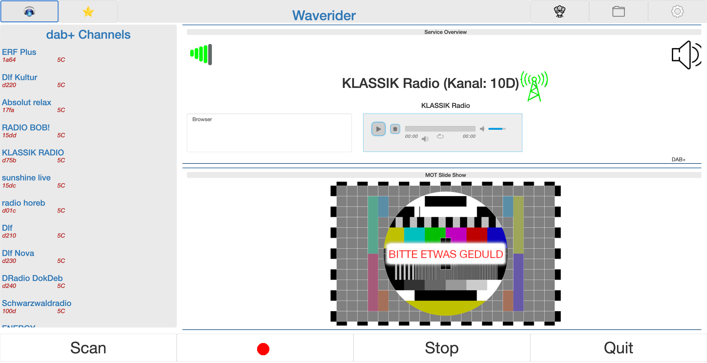
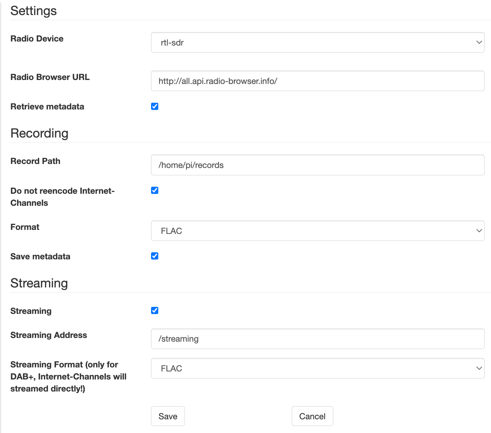

# waverider
 Ein DAB+/Internet Radio Server.
 
 Um das Dokument in anderen Sprachen zu lesen: [Englisch](README.md), [Russisch](README.ru.md).

 Waverider ist eine Software mit der sowohl Radiosender über DAB+ als auch über das Internet empfangen werden können. Waverider soll die vielen Defizite gängiger Digitalradios ausmerzen. Dazu gehört beispielsweise auch das aufzeichnen von Radioprogrammen wie zu Zeiten der Audiokassette. Es handelt sich dabei um eine Software, die anders als z. B. [Welle.io](https://www.welle.io/), die Steuerung über eine WebGUI ermöglicht und damit bequem über verschiedene Endgeräte als eine Art Fernbedienung gesteuert werden kann. Die Soundausgabe erfolgt dabei entweder über die heimische Stereoanlage oder auch über einen Browser, wenn der Server über einen Desktop-Browser (z. B. am Notebook oder PC) angesprochen wird. Zusätzlich kann das Radioprogramm, egal ob Internetsender oder DAB+, in vielen gängigen Formaten (AAC, MP3, FLAC, WAV, etc.) aufgezeichnet werden. Als Entwickler betreibe ich hierfür einen Raspberry PI mit der Erweiterungsplatine HiFiBerry (mehr s. u.), auf dem ein Headless System (Raspbian) installiert ist.   

## Voraussetzungen

### Hardware

 Die hier aufgezählten Komponenten sind lediglich als Empfehlung zu verstehen. 

 - [Raspian PI Version 4](https://www.berrybase.de/raspberry-pi-4)
 - [HifiBerry dac+](https://www.reichelt.de/raspberry-pi-shield-hifiberry-digi-pro-rpi-hb-digi-pro-p191035.html?PROVID=2788&gclid=Cj0KCQiAiJSeBhCCARIsAHnAzT__QmJPWgV-ErtblZ-7ycyYZwIkmJqCKKA4leR8-YvK2ETBWSpr_3AaAh9kEALw_wcB)
 - [HiFiBerry+ Metall Gehäuse](https://www.amazon.de/HiFiBerry-Digi-Metall-Raspberry-schwarz-Black/dp/B08YDNJVRL/ref=sr_1_2?__mk_de_DE=%C3%85M%C3%85%C5%BD%C3%95%C3%91&crid=2NMDXL3KY4TLW&keywords=HIFI+berry%2B+metall+case&qid=1673864322&sprefix=hifi+berry%2B+metall+case%2Caps%2C84&sr=8-2).
 - [DVB-T/DAB+ USB Stick](https://www.amazon.de/DollaTek-Digitale-Fernsehtuner-Empf%C3%A4nger-Unterst%C3%BCtzung/dp/B07DJT5NHD/ref=sr_1_5?keywords=dvb-t+stick+usb&qid=1673864429&sprefix=dvb-t+st%2Caps%2C87&sr=8-5)

 Grundsätzlich ist **waverider** für jedwede Linux/Unix/Mac-Umgebung kompilier- und nutzbar. Es wird auch nicht zwingend ein USB Empfangsstick benötigt. Der Stick kann auch an einem anderem Rechner / Gerät eingesteckt und über das Netzwerk betrieben werden. Das macht beispielsweise Sinn, wenn an einem anderen Standort ein besserer Radioempfang möglich ist.     

### Software

 Folgende Bibliotheken werden für **waverider** benötigt:

 - Zum Kompilieren wird [cmake](https://cmake.org/) benötigt.
 - Für die WebGUI [Wt](https://www.webtoolkit.eu/wt)
 - MP3 Bibliothek [libmpg123](https://www.mpg123.de/)
 - Für alle Features (mehr Codecs, mehr Internetradiosender, etc.) [FFMPEG](https://ffmpeg.org/download.html)
 - [boost] (https://www.boost.org/)
 - [rtlsdr] (https://github.com/osmocom/rtl-sdr)
 - Für DAB+ Radio [libfaad](https://wiki.videolan.org/FAAD2_and_FAAC/)
 - Für DAB+ Radio [FFTW](https://www.fftw.org/)
 - Für Soundausgabe über HiFi: [Alsa](https://www.alsa-project.org/wiki/Main_Page)

## Installation

### Voraussetzungen installieren

 Zunächst alle Bibliotheken installieren. Unter Mac empfiehlt sich hierfür zum Beispiel [Homebrew](https://brew.sh/). Unter Raspian oder Debian Linux reichen i. d. R. die Pakete:

 ```
 sudo apt-get install alsa-utils
 sudo apt-get install cmake
 sudo apt-get install ffmpeg
 sudo apt-get install libboost1.74-all-dev
 sudo apt-get install libfaad2
 sudo apt-get install libfaad-dev
 sudo apt-get install libfftw3-3
 sudo apt-get install libfftw3-dev
 sudo apt-get install libssl-dev
 ```

 Unter debian sollte die GUI wt auch zur Verfügung stehen. 

 ```
 sudo apt-get install witty witty-dev witty-doc witty-dbg
 ```

 Bei raspbian ist das leider nicht der Fall und muss händisch kompiliert werden. 

 ```
 wget https://github.com/emweb/wt/archive/4.8.3.tgz
 ```

 Archiv extrahieren, danach:
 ```
 cmake .
 make
 make install
 ```

 Sollte eine Fehlermeldung ausgegeben werden, folgendes in die Datei CMakeList.txt eintragen:
 ```
 set(CMAKE_CXX_LINK_FLAGS "${CMAKE_CXX_LINK_FLAGS} -latomic") 
 ```
 und anschließend den Vorgang wiederholen.

 Wird **waverider** unter MacOS installiert und benutzt, kann das vorherige ausführen von:

 ```
 export LIBRARY_PATH="/usr/local/opt/librtlsdr/lib:/usr/local/opt/mpg123/lib:/usr/local/opt/faad2/lib:/usr/local/opt/fftw/lib:/usr/local/lib"
 ```
 notwendig werden.

### Waverider installieren

 ```
 wget https://github.com/svenali/waverider/archive/wr-0.9.tar.bz2
 cd wr-0.9
 mkdir build
 cd build
 cmake ../
 make
 ```

## Schnelleinstieg

### waverider starten

 Gestartet wird **waverider** mit:

 ```
 ./waverider --approot=../approot --docroot=../docroot --http-listen 0.0.0.0:9090
 ```
 Es empfiehlt sich das Anlegen eines Skriptes (z. B. wr.sh):

 ```
 #!/bin/bash
 ./waverider --approot=../approot --docroot=../docroot --http-listen 0.0.0.0:9090 &
 ```

### waverider aufrufen
 
 Jetzt in einem Browser die Adresse des Gerätes aufrufen, auf dem waverider läuft. Zum Beispiel

 ```
 http://pi4:9090
 ```

 Danach sollte in etwa folgendes auf dem Bildschirm erscheinen:

 

 Nun oben rechts auf das Rädchen (Einstellungen) klicken und entsprechend dem gewünschten anpassen:

 

 In der Regel reicht die Anpassung des Aufnahmeordners. Des Weiteren kann hier auch die Auswahl des Codecs für die Aufzeichnung angepasst werden. Bei Internetradiosendern empfiehlt sich zunächst den Codec des Senders beizubehalten. Wenn die FFMPEG Unterstützung nicht mitinstalliert wurde, wird nur die WAV-Aufnahme zur Verfühung gestellt. Sollte der USB-Stick in einem anderen Gerät benutzt werden, muss für den DAB+ USB Stick die entsprechende Adresse eingegeben werden.

 Danach wieder auf das Rädchen oben rechts klicken um die Einstellungen zu schließen. Jetzt können über Scan die DAB+ Radio Stationen gesucht werden. Die Internetradiostationen werden heruntergeladen, wenn vorher dafür in den Internetradiomodus gewechselt wird (auf die Erde mit dem Kopfhörer oben links klicken und danach auf Scan).

 Nach alles Scans landen die Sender entsprechend im Auswahlmenü links und können angeklickt werden.

 Viel Spaß!

## Lizenz

 GPL 3.0

## Danksagung

 Ich danke den Entwicklern von [welle.io](https://www.welle.io/) für die geleistete Arbeit.

## Hilfe

 Gerne Feedback bzw. Problemmeldungen an mich: svenali [at] gmx [dot] de.