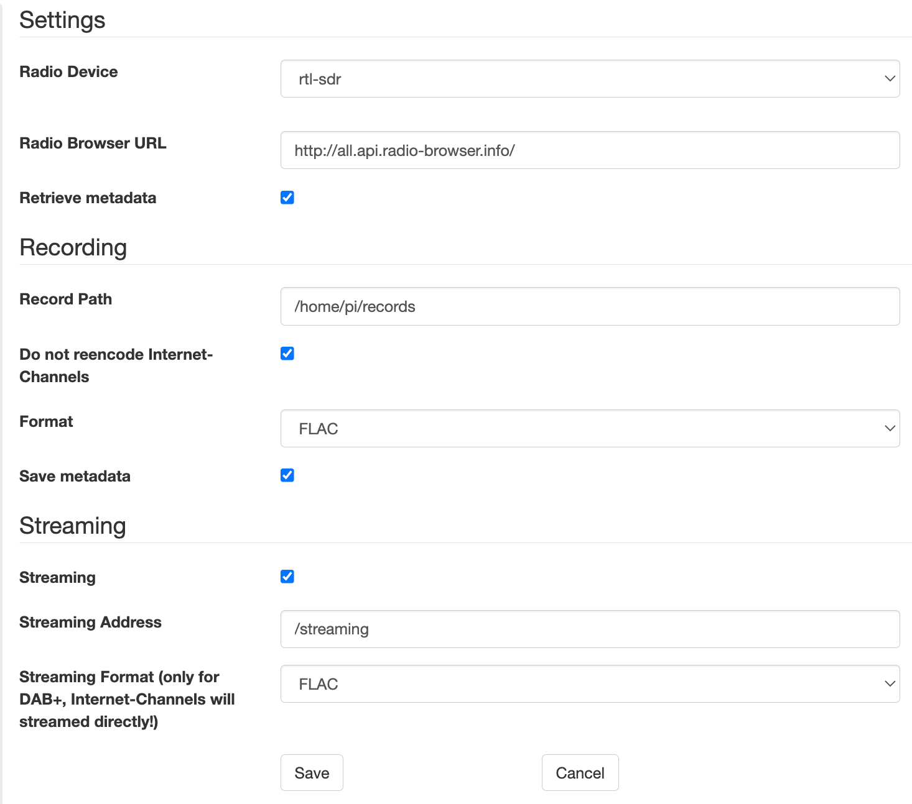

# waverider
 A DAB+ Radio Server.
 
 Read this document in other languages: [german](README.de.md), [russian](README.ru.md).

 Waverider is a software with which radio stations can be received via DAB+ as well as via the Internet. Waverider is supposed to eliminate the many deficits of current digital radios. This includes, for example, the recording of radio programmes as in the days of the audio cassette. It is a software that, unlike [Welle.io](https://www.welle.io/) for example, allows control via a WebGUI and can thus be conveniently controlled via various end devices as a kind of remote control. The sound output is either via the home stereo system or via a browser if the server is accessed from a desktop browser (e.g. on a notebook or PC). In addition, the radio programme, regardless of whether it is an Internet station or DAB+, can be recorded in many common formats (AAC, MP3, FLAC, WAV, etc.). I use a Raspberry PI with the HiFiBerry expansion board (see below for more), on which a headless system (Raspbian) is installed.

## Requirements

 The components listed here are only to be understood as recommendations.

 - [Raspian PI Version 4](https://www.berrybase.de/raspberry-pi-4)
 - [HifiBerry dac+](https://www.reichelt.de/raspberry-pi-shield-hifiberry-digi-pro-rpi-hb-digi-pro-p191035.html?PROVID=2788&gclid=Cj0KCQiAiJSeBhCCARIsAHnAzT__QmJPWgV-ErtblZ-7ycyYZwIkmJqCKKA4leR8-YvK2ETBWSpr_3AaAh9kEALw_wcB)
 - [HiFiBerry+ Metall Gehäuse](https://www.amazon.de/HiFiBerry-Digi-Metall-Raspberry-schwarz-Black/dp/B08YDNJVRL/ref=sr_1_2?__mk_de_DE=%C3%85M%C3%85%C5%BD%C3%95%C3%91&crid=2NMDXL3KY4TLW&keywords=HIFI+berry%2B+metall+case&qid=1673864322&sprefix=hifi+berry%2B+metall+case%2Caps%2C84&sr=8-2).
 - [DVB-T/DAB+ USB Stick](https://www.amazon.de/DollaTek-Digitale-Fernsehtuner-Empf%C3%A4nger-Unterst%C3%BCtzung/dp/B07DJT5NHD/ref=sr_1_5?keywords=dvb-t+stick+usb&qid=1673864429&sprefix=dvb-t+st%2Caps%2C87&sr=8-5)

 **waverider** can be compiled and used in any Linux/Unix/Mac environment. A USB receiver stick is not necessarily required. The stick can also be plugged into another computer/device and operated via the network. This makes sense, for example, if better radio reception is possible at another location in your home.

### Software

 You need to install or compile following libraries from the internet or your distribution to get **waverider** to run:

 - Compiling with [cmake](https://cmake.org/) benötigt.
 - The WebGUI needs [Wt](https://www.webtoolkit.eu/wt)
 - MP3 Library [libmpg123](https://www.mpg123.de/)
 - For all features (Codecs, etc.) [FFMPEG](https://ffmpeg.org/download.html)
 - [boost] (https://www.boost.org/)
 - [rtlsdr] (https://github.com/osmocom/rtl-sdr)
 - DAB+ Radio needs [libfaad](https://wiki.videolan.org/FAAD2_and_FAAC/)
 - DAB+ Radio needs also [FFTW](https://www.fftw.org/)
 - Sound output via HiFi needs: [Alsa](https://www.alsa-project.org/wiki/Main_Page)

## Installation

### Installation of the requirements

 First install all the libraries. Under Mac, for example, [Homebrew](https://brew.sh/) is recommended. Under Raspian or Debian Linux:

 ```
 sudo apt-get install alsa-utils
 sudo apt-get install cmake
 sudo apt-get install ffmpeg
 sudo apt-get install libboost1.74-all-dev
 sudo apt-get install libfaad2
 sudo apt-get install libfaad-dev
 sudo apt-get install libfftw3-3
 sudo apt-get install libfftw3-dev
 sudo apt-get install libssl-dev
 ```

 Under * *debian* * the GUI wt is available and can be installed with:

 ```
 sudo apt-get install witty witty-dev witty-doc witty-dbg
 ```
 
 In the depository of raspbian, the wt library is missing, so you have to compile the library by your own with:

 ```
 wget https://github.com/emweb/wt/archive/4.8.3.tgz
 ```

 unzip your the archive and then:
 
 ```
 cd wr-<ver>
 cmake .
 make
 make install
 ```

 In case of errors it useally helps, if you add the following entry in the file CMakeList.txt: 

 ```
 set(CMAKE_CXX_LINK_FLAGS "${CMAKE_CXX_LINK_FLAGS} -latomic") 
 ```

 save the file and repeat the steps of compililation.

 If **waverider** should be installed under MacOS, it helps in case of error to update your library path with:

 ```
 export LIBRARY_PATH="/usr/local/opt/librtlsdr/lib:/usr/local/opt/mpg123/lib:/usr/local/opt/faad2/lib:/usr/local/opt/fftw/lib:/usr/local/lib"
 ```

 ### Compile and install waverider

 ```
 wget https://github.com/svenali/waverider/archive/wr-0.9.tar.bz2
 cd wr-0.9
 mkdir build
 cd build
 cmake ../
 make
 ```
 
## Fast start and usage

 Start **waverider** with:

 ```
 ./waverider --approot=../approot --docroot=../docroot --http-listen 0.0.0.0:9090
 ```
 It is recommended to create a script for a faster and easier start. You can also add your script to the end of a start process (name the skript f. e.: wr.sh):

 ```
 #!/bin/bash
 ./waverider --approot=../approot --docroot=../docroot --http-listen 0.0.0.0:9090 &
 ```

### Use waverider

 In a Browser write f. e.: 

 ```
 http://pi4:9090
 ```

 You should see such a website:

 

 Now please click on the button in the top right-hand corner and adjust **waverider** to the desired settings:

 

 As a rule, it is sufficient to adjust the recording folder. Furthermore, the selection of the codec for the recording can also be adjusted here. In the case of Internet radio stations, it is recommended to initially keep the station's codec. If FFMPEG support has not been installed, only WAV recording is available. If the USB stick is used in another device, the corresponding address must be entered for the DAB+ USB stick.

 Then click on the wheel at the top right again to close the settings. Now the DAB+ radio stations can be searched for via pressing "Scan". The Internet radio stations are downloaded if you first switch to Internet radio mode (click on the earth with the headphones at the top left and then on Scan).

 After all scans, the stations appear in the selection menu on the left and can be clicked on.

 Have Fun!

## Lizenz

 GPL 3.0

## Acknowlewdgement

 I want to thank especially the developers from [welle.io](https://www.welle.io/) for their excellent work.

## Help

 Please send feedback or in case of problems a mail to: svenali [at] gmx [dot] de.