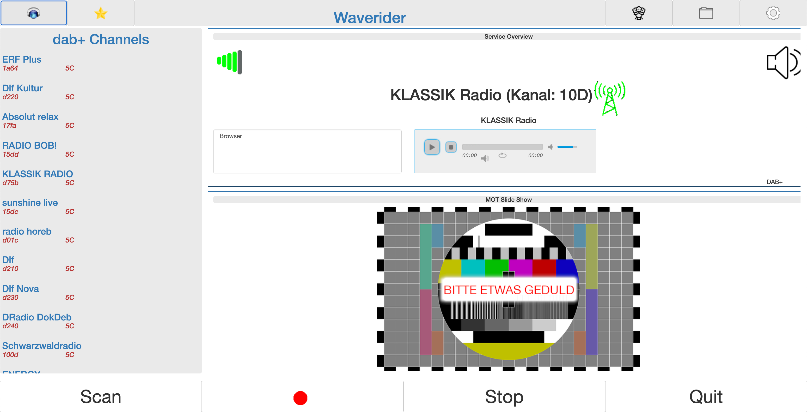

# waverider
 DAB+/Internet Radio Server.
 
 Для других языков, перейдите по ссылке: [Английский](README.md), [Немецкий](README.de.md).

 Waverider является ПО для радиоприема в диапазоне DAB+ (Digital Audio Broadcasting) и через интернет. Waverider способен убирать все отрицательные свойства других приборов. К этому относится даже записание полученной программой (например музыки), как в те времена, когда все люди записывали музыку на кассеты. Это ПО в сравнении с [Welle.io](https://www.welle.io/) работает по-другому, предоставляет потребителям WebGUI, т. е. управление **waverider** будет возможно через браузер и потребители могут управлять сервером в качестве пульта дистанционного управления.    
 Музыка будет воспроизведена через стереоаппаратуру или, если ПО (сервер) **waverider** управляется браузером, через колонки компьютера. 
 Кроме того радио программа, не важно интернет или DAB+, может записыватся в разных форматах
 (AAC, MP3, FLAC, WAV, etc.). Я использую для ПО **waverider** Raspberry PI с расширением HiFiBerry. Там я установил Headless System (Raspbian).   

## Условия

### Аппаратное обеспечение

 Из личного опыта я рекомендую использовать cледующее оборудование:

 - [Raspian PI Version 4](https://www.berrybase.de/raspberry-pi-4)
 - [HifiBerry dac+](https://www.reichelt.de/raspberry-pi-shield-hifiberry-digi-pro-rpi-hb-digi-pro-p191035.html?PROVID=2788&gclid=Cj0KCQiAiJSeBhCCARIsAHnAzT__QmJPWgV-ErtblZ-7ycyYZwIkmJqCKKA4leR8-YvK2ETBWSpr_3AaAh9kEALw_wcB)
 - [HiFiBerry+ Metall Gehäuse](https://www.amazon.de/HiFiBerry-Digi-Metall-Raspberry-schwarz-Black/dp/B08YDNJVRL/ref=sr_1_2?__mk_de_DE=%C3%85M%C3%85%C5%BD%C3%95%C3%91&crid=2NMDXL3KY4TLW&keywords=HIFI+berry%2B+metall+case&qid=1673864322&sprefix=hifi+berry%2B+metall+case%2Caps%2C84&sr=8-2).
 - [DVB-T/DAB+ USB Stick](https://www.amazon.de/DollaTek-Digitale-Fernsehtuner-Empf%C3%A4nger-Unterst%C3%BCtzung/dp/B07DJT5NHD/ref=sr_1_5?keywords=dvb-t+stick+usb&qid=1673864429&sprefix=dvb-t+st%2Caps%2C87&sr=8-5)

 На самом деле **waverider** адресован всем, кто использует операционную систему Linux или Unix или Mac на своём устройстве. USB прибор для DAB+ не обязателен. USB-приемник может быть установлено на другом устройстве и может исползоваться через другой компьютер. Это имеет смысл, если например радиоприем в другом месте лучше. 

### ПО

 Вам необходимо установить вот эти дополнительные ПО и библиотеки для **waverider**:

 - Для компиляции [cmake](https://cmake.org/)
 - Для WebGUI [Wt](https://www.webtoolkit.eu/wt)
 - MP3 библиотека [libmpg123](https://www.mpg123.de/)
 - Для всех услуг (больше Codecs, etc.) [FFMPEG](https://ffmpeg.org/download.html)
 - [boost] (https://www.boost.org/)
 - [rtlsdr] (https://github.com/osmocom/rtl-sdr)
 - Для радиоприема DAB+ [libfaad](https://wiki.videolan.org/FAAD2_and_FAAC/)
 - Для радиоприеме DAB+ Radio [FFTW](https://www.fftw.org/)
 - Для выход музыки через стереоаппаратуру: [Alsa](https://www.alsa-project.org/wiki/Main_Page)

## Установление

### Установить условия

 С самом сначала установка все библиотеки. На устройстве Mac рекоммендуется [Homebrew](https://brew.sh/). 
 
 На Raspian или Debian Linux достаточно установки следующих ПО:

 ```
 sudo apt-get install alsa-utils
 sudo apt-get install cmake
 sudo apt-get install ffmpeg
 sudo apt-get install libboost1.74-all-dev
 sudo apt-get install libfaad2
 sudo apt-get install libfaad-dev
 sudo apt-get install libfftw3-3
 sudo apt-get install libfftw3-dev
 sudo apt-get install libssl-dev
 ```

 На debian GUI wt доступена и может быть установлена эта команда: 

 ```
 sudo apt-get install witty witty-dev witty-doc witty-dbg
 ```

 На raspbian к сожалению это не так, вам надо установить **wt** вручную.

 ```
 wget https://github.com/emweb/wt/archive/4.8.3.tgz
 ```

 Распакуйте файл, и затем:

 ```
 cmake .
 make
 make install
 ```

 В случае указания ошибки, добавьте следющую строчку в файл CMakeList.txt:
 ```
 set(CMAKE_CXX_LINK_FLAGS "${CMAKE_CXX_LINK_FLAGS} -latomic") 
 ```
 и повторите компиляцию ещё раз.

 Для компиляции **waverider** на MacOS, может потребоваться написание следующей строки в терминал:

 ```
 export LIBRARY_PATH="/usr/local/opt/librtlsdr/lib:/usr/local/opt/mpg123/lib:/usr/local/opt/faad2/lib:/usr/local/opt/fftw/lib:/usr/local/lib"
 ```

### Установка ПО Waverider

 ```
 wget https://github.com/svenali/waverider/archive/wr-0.9.tar.bz2
 cd wr-0.9
 mkdir build
 cd build
 cmake ../
 make
 ```

## Старт waverider

### waverider стартовать

 Запустите **waverider** так:

 ```
 ./waverider --approot=../approot --docroot=../docroot --http-listen 0.0.0.0:9090
 ```
 
 Рекомендую писать скрипт (например wr.sh):

 ```
 #!/bin/bash
 ./waverider --approot=../approot --docroot=../docroot --http-listen 0.0.0.0:9090 &
 ```

### Управление waverider
 
 Сейчас пишите в адресную строку браузера адрес прибора на котором запушен **waverider**.
 
 Например:

 ```
 http://pi4:9090
 ```

 Затем сайт должен быть на экране виден (см. следующую картинку).

 

 На верху, на правой стороне, нажмите на ссылку настроек и исправьте ваши настроики так, как вам необходимо:

 

 На самом деле достаточно исправления записанной папки. Кроме того, здесь можно настроить Codecs для записывания музыки. На случай интернет радиоприема рекомендую оставить Codec станции, чтобы сэкономить хранилище. Если FFMPEG не установлено, доступно только записание в формате WAV. Те, кто исползуют USB-приемник могут указать здесь адрес другого устройства.

 Затем снова нажать на кнопку настроек, чтобы закрыть настройки. Сейчас через кнопку SCAN, все радиостанции в эфире вашего региона могут быть найдены. Интернет станции могут скачаны, если вы меняете режим в онлайн (нажмите на землю с наушниками наверху слево и затем на Scan).

 После всех Scans, все станции будут выбраны в меню на левой стороне.

 Приятного послушивания!

## Лицензия

 GPL 3.0

## Благодарность

 Я благодарен разработчикам [welle.io](https://www.welle.io/) за их работу.

## Помощь

 Обратитесь к мне в случай проблем или для обратной связи: svenali [at] gmx [dot] de.